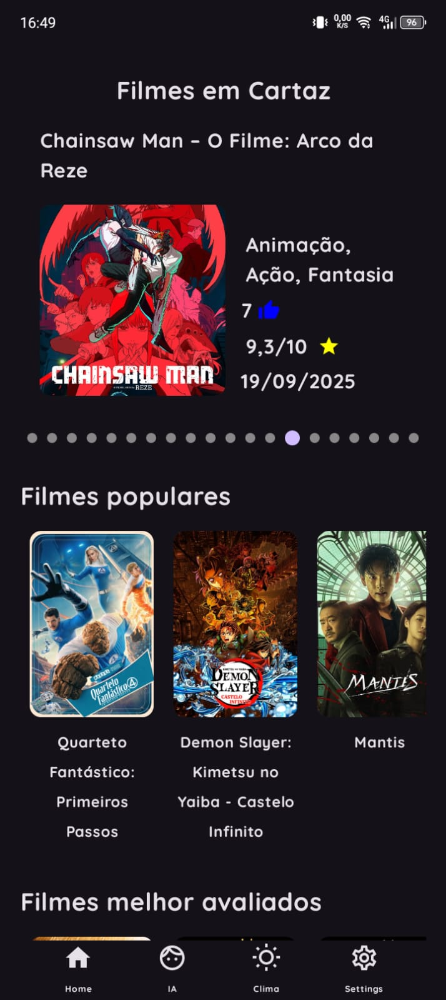
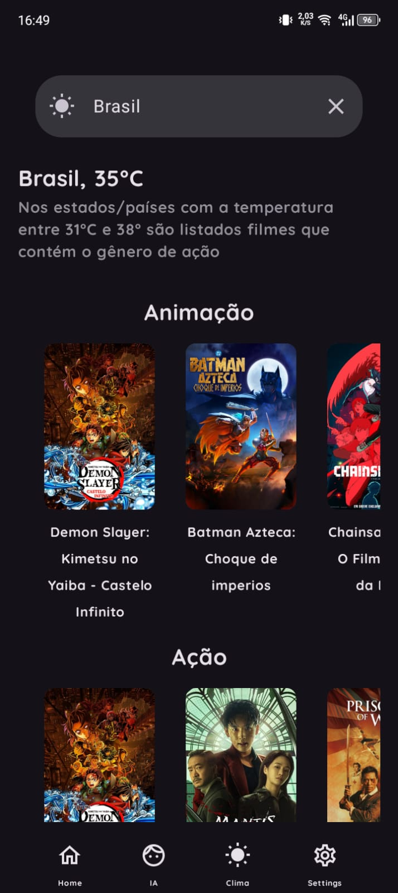
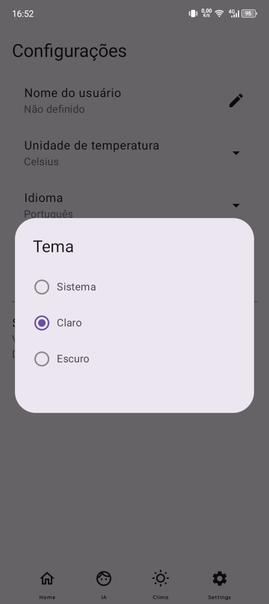

# 🎬 ClimaFlim  

**ClimaFlim** é um aplicativo Android criado para auxiliar o usuário a escolher um filme ou série para assistir usando o clima de algum estado ou país no momento.  
As regras do gênero que irá ser listado você pode conferir na documentação da [API ClimaApi](https://github.com/wpmello/climafilm-api).  

---

## 🧰 Tecnologias e Arquitetura

O **ClimaFilm App** foi desenvolvido utilizando **Android nativo moderno** com foco em **Clean Architecture** e **boas práticas de escalabilidade e testabilidade**.

- 🏗 **Arquitetura:** Clean Architecture + MVVM  
- 🧩 **UI:** Jetpack Compose + Navigation Component (NavHost)  
- ⚙️ **Injeção de dependência:** Hilt (Dagger)  
- 🔄 **Concorrência:** Kotlin Coroutines + Flow  
- 💾 **Camada de dados:** Retrofit
- 🧠 **Gerenciamento de estado:** ViewModel + StateFlow  
- 🎨 **Design System:** Material 3  

Essas tecnologias foram escolhidas para garantir:
- Separação clara de responsabilidades entre camadas  
- Código modular e de fácil manutenção  
- Facilidade para evoluir o app e adicionar novas features  
- Melhor testabilidade e reuso de componentes  


---

## ⚙️ Funcionalidades  

- [x] Listagem e atualização de filmes em tempo real  
- [x] Tela de pesquisa para encontrar um estado/país e receber filmes com o gênero baseado no clima do local pesquisado  
- [x] Tela de detalhes do filme  
- [x] Tela de configuração (idioma, tema do aplicativo, formato de temperatura °C/°F, etc.)  
- [ ] Tela de IA para auxílio na escolha do filme/série (em desenvolvimento)  
- [ ] Tela de login (em desenvolvimento)  
- [ ] Sistema de assinatura mensal (em desenvolvimento)  

---

## 📸 Screenshots / GIFs  

<table>
  <tr>
    <td></td>
    <td></td>
    <td></td>
    <td></td>
  </tr>
  <tr>
    <td><p align="center">Tela Inicial</p></td>
    <td><p align="center">Tela de Clima</p></td>
    <td><p align="center">Detalhes do filme</p></td>
    <td><p align="center">Tela de Configuração</p></td>
  </tr>
</table>

---

## 📲 Download para testar o app
Baixe a versão mais recente do ClimaFlim e instale no seu dispositivo Android:

[📥 Baixar última versão](https://github.com/wpmello/climafilm-app/releases/tag/v1.0.0)

---

## 📦 Como rodar o projeto localmente

Se você quiser clonar e rodar o projeto na sua máquina, siga os passos abaixo:

### 🔹 Pré-requisitos
- [Android Studio](https://developer.android.com/studio) (última versão recomendada).
- [Java JDK 17+](https://adoptium.net/).
- [Gradle](https://gradle.org/install/) (opcional, já vem no Android Studio).
- Git instalado na máquina.
- Ter a [API ClimaApi](https://github.com/wpmello/climafilm-api) devidamente rodando na sua máquina.

### 🔹 Passo a passo

1. Clone o repositório:
   ```bash
   git clone https://github.com/wpmello/climafilm-app.git
   
2. Vá em File > Open... e selecione a pasta do projeto.

3. Aguarde o Android Studio sincronizar o Gradle e baixar as dependências.

4. Conecte um dispositivo Android ou inicie um Emulador no Android Studio.

5. Com a ClimaFilmApi rodando corretamente, clique em ▶️ Run para instalar e executar o app.

### 🔹 Observações

- Recomendo usar o emulador do Android Studio com Android 10+.
- O Gradle e o SDK serão baixados automaticamente, mas pode levar alguns minutos na primeira vez.
